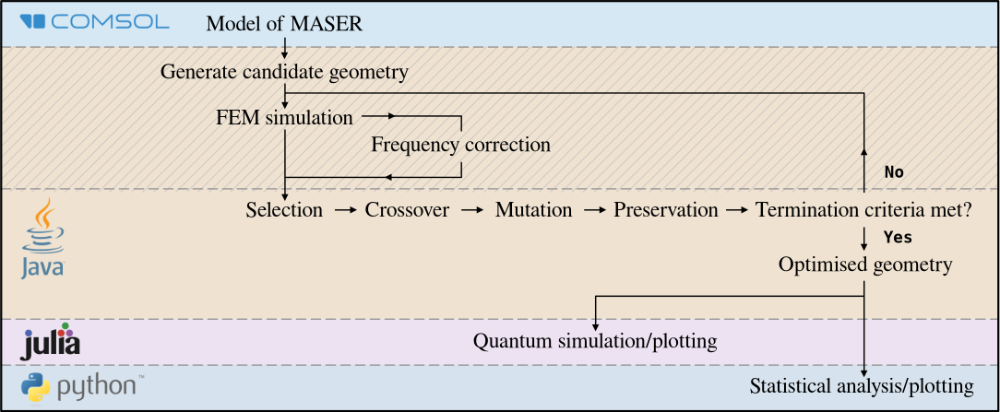

# MASER Geometry Optimisation

**High-dimensional black-box optimisation with stochastic search, numerical simulation and statistical analysis**

> Individual Master's project - MEng Materials Science and Engineering, Imperial College London



This project investigates the use of **stochastic optimisation to solve a high-dimensional, computationally expensive black-box optimisation problem**.

The application is the optimisation of a microwave resonator for a pentacene MASER, but the core computational problem is more general: **searching a discrete space of $2^{100}$ possible configurations when evaluating a single candidate requires an expensive finite-element simulation**.

I designed and implemented the optimisation and simulation pipeline from the ground up, including the Java optimisation engine, COMSOL automation, frequency correction, result caching, experiment metadata and reproducibility infrastructure. Julia is used for downstream physical modelling, while Python is being developed for statistical analysis of optimisation behaviour.

The project is particularly concerned with a question that is central to computational research:

> When an optimisation algorithm appears to find a better solution, how can we determine whether the improvement is genuine, reproducible and actually aligned with the underlying objective?

---

## Project at a glance

| Component | Description |
|---|---|
| Problem | Optimise a 100-dimensional discrete design space |
| Search space | $2^{100} \approx 27 \cdot 10^{30}$ configurations |
| Optimisation | Binary genetic algorithm |
| Objective | Expensive simulation-based black-box fitness function |
| Simulation | COMSOL finite-element electromagnetic model |
| Optimisation engine | Java + Jenetics |
| Post-processing | Julia |
| Statistical analysis | Python |
| Reproducibility | Configurable random seeds + run metadata |
| Efficiency | Evaluation caching + interpolation-based frequency correction |
| Typical run time | up to 8 hours for 250 generations on the development system |

---

## Why this is an interesting optimisation problem

The design is represented by a binary vector

$$
x \in \{0,1\}^{100},
$$

giving approximately

$$
2^{100} \approx 1.27 \cdot 10^{30}
$$

Exhaustive search is therefore infeasible.

More importantly, the objective function is **expensive**. A candidate solution cannot simply be evaluated with a closed-form expression: the optimisation pipeline must construct the corresponding model, run a finite-element simulation and extract the resulting objective value.

This creates several challenges familiar from computational optimisation:

- High-dimensional discrete search
- Expensive objective evaluations
- Stochastic optimisation
- Limited evaluation budgets
- Repeated evaluations of identical candidates
- Potentially misleading proxy objectives
- Need for reproducible experiments
- Need to distinguish optimisation signal from stochastic variation

These constraints motivated the design of the optimisation framework as much as the choice of optimisation algorithm itself.

---

## Approach

The complete computational workflow is:

             Candidate configuration
                      │
                      ▼
             Binary genetic algorithm
                      │
                      ▼
              Evaluation / cache
                 ┌────┴────┐
                 │         │
              Cache hit   New model
                 │         │
                 │         ▼
                 │    COMSOL FEM solve
                 │         │
                 │         ▼
                 │    Objective value
                 │         │
                 └────┬────┘
                      │
                      ▼
                Fitness returned
                      │
                      ▼
              Population evolves
                      │
                      ▼
             Logged run + metadata
                      │
              ┌───────┴────────┐
              ▼                ▼
        Julia modelling   Python analysis

The optimisation layer is implemented in Java and interfaces with COMSOL through its Java API. The resulting system behaves as an **expensive black-box optimisation loop**: the genetic algorithm proposes a candidate and the simulation backend determines its fitness.

### Genetic Algorithm

The principal configuration uses:

| Parameter | Value |
|---|---|
| Representation | Binary chromosome |
| Number of variables | 100 |
| Population size | 20 |
| Selection | Tournament selection |
| Tournament size | 3 |
| Mutation probability | 0.05 |
| Crossover | Single-point |
| Crossover probability | 0.8 |
| Offspring fraction | 0.8 |
| Elitism | 2 individuals |
| Maximum generations | 250 |
| Objective | Single-objective maximisation |

The optimiser supports **explicit random seeds**, allowing individual experiments to be reproduced and different seeds to be compared systematically.

See `src/java/README.md` for implementation details.

---

## Making expensive evaluations tractable

A major constraint is the cost of evaluating the objective function. A typical 250-generation run can take up to **eight hours**, making unnecessary evaluations particularly expensive.

Two mechanisms were therefore implemented to reduce computational cost.

### Evaluation caching

The optimisation framework maintains a cache of previously evaluated configurations.

If the genetic algorithm generates a configuration that has already been evaluated, the previous result can be returned without repeating the FEM simulation.

This is important because the optimiser is operating in a discrete space: **the same candidate can reappear during a stochastic search**. Reusing its previous evaluation avoids spending additional computational resources on an identical calculation.

### Frequency correction and interpolation

The optimisation is subject to a target resonance frequency.

Rather than repeatedly rebuilding the model solely to correct the resonance frequency, the implementation uses a scaling procedure based on the relationship between resonance frequency and relative permittivity.

The most recent simulated points are used to construct a **Lagrange interpolating polynomial**, providing an estimate of the scaling required to reach the target frequency.

This reduces the computational burden associated with repeatedly adjusting the model during optimisation.

Detailed implementation and modelling information is available in the component documentation.

---

## Reproducibility and experiment metadata

Reproducibility is treated as part of the optimisation infrastructure rather than as an afterthought.

Each experiment can be run with an explicitly specified **random seed**, allowing the stochastic search process to be repeated exactly under the same configuration.

The project also implements a metadata system for recording the information associated with optimisation runs, including experiment configuration and generated results.

This makes it possible to distinguish between:

- different random seeds;
- different optimisation configurations;
- different model/simulation conditions;
- different experimental runs; and
- different result sets.

This infrastructure is particularly important for the statistical analysis: comparing stochastic optimisation runs is only meaningful when the underlying experimental conditions are known.

---

## Key result: optimisation can expose problems with the objective

Under the original lossless model, the optimiser discovered a configuration with a substantially higher value of the simulation objective than the baseline:

| Design | Objective value |
|---|---|
| Baseline | $1.003 \cdot 10^{11}$ |
| Optimised | $6.55557 \cdot 10^{11}$ |
| Improvement | $ \sim 6.54 \times $ |

This demonstrates that the evolutionary search can discover substantially different solutions within the high-dimensional design space.

However, the more interesting result came when the model was made more realistic.

Introducing dielectric losses caused highly optimised solutions to increasingly correspond to **undesired electromagnetic modes**, despite satisfying the target resonance condition.

The result exposed a fundamental limitation in the original optimisation formulation:

> Maximising a proxy objective does not necessarily maximise the quantity that actually matters.

In this case, maximising the Purcell factor alone was insufficient to guarantee the desired operating mode.

From a computational-research perspective, this is an important result in its own right. It demonstrates why **objective-function specification, constraints and validation of optimised solutions** matter as much as the optimisation algorithm.

A more robust formulation would incorporate explicit mode selection or a physically motivated constraint alongside the existing objective.

---

## Statistical analysis

The optimisation is stochastic, so a single successful run is not sufficient evidence that the algorithm performs reliably.

The Python analysis layer is therefore being developed to examine the distribution of optimisation outcomes across controlled experiments.

The intended analysis includes:

- performance across independent random seeds;
- best and typical fitness;
- mean and median performance;
- standard deviation and interquartile range;
- convergence behaviour;
- variation between optimisation runs;
- computational cost;
- comparison against alternative search strategies.

A particularly important future comparison is between the genetic algorithm and **random search under a matched evaluation budget**.

The aim is to determine whether the structure introduced by evolutionary search provides a meaningful advantage over simply evaluating many randomly selected configurations.

This part of the project is **actively being extended**, with the Java optimisation and Julia modelling components complete and the Python statistical-analysis layer under development.

See `src/python/README.md` for the current analysis implementation.

---

## Engineering

The project is implemented as a multi-language computational research pipeline, with each language serving a distinct role.

### Java - optimisation and simulation orchestration

Java contains the main optimisation engine and is responsible for:

- genetic algorithm configuration and execution;
- candidate representation;
- experiment configuration;
- random-seed control;
- evaluation caching;
- COMSOL interaction;
- simulation execution;
- objective extraction;
- result logging;
- experiment metadata; and
- output generation.

The code is organised into separate components for optimisation, configuration, simulation, model representation, input/output and utilities.

See `src/java/README.md`.

### COMSOL - expensive objective evaluation

COMSOL provides the finite-element simulation used to evaluate candidate configurations.

The Java application automates the relevant stages of the simulation workflow, including:

1. constructing the candidate geometry;
2. configuring the model;
3. applying the frequency-correction procedure;
4. generating the finite-element mesh;
5. solving the model;
6. extracting the required quantities; and
7. returning the resulting objective value to the optimiser.

See `comsol/README.md`.

### Julia - downstream modelling

Julia provides a separate post-optimisation modelling stage.

The optimised electromagnetic properties are passed to a quantum model to estimate the resulting system behaviour.

This keeps the expensive geometry search separate from the downstream physical analysis.

See `src/julia/README.md`.

---

## Technology stack

| Area | Technology |
|---|---|
| Optimisation | Java |
| Genetic algorithm | Jenetics |
| Build system | Maven |
| Numerical simulation | COMSOL Multiphysics |
| Simulation integration | COMSOL Java API |
| Post-optimisation modelling | Julia |
| Quantum modelling | QuantumCumulants |
| Statistical analysis | Python |
| Version control | Git |
| Elitism | 2 individuals |
| Maximum generations | 250 |
| Objective | Single-objective maximisation |

---

## Repository structure

```text
maser-geometry-optimisation/
│
├── comsol/
│   ├── ComsolModel.mph
│   ├── README.md
│   └── script/
│
├── docs/
│   ├── thesis/
│   ├── presentation/
│   └── statistical-analysis/
│
├── results/
│   ├── raw/
│   ├── processed/
│   └── plots/
│
├── src/
│   ├── java/
│   │   └── README.md
│   ├── julia/
│   │   └── README.md
│   └── python/
│       └── README.md
│
├── CITATION.cff
├── LICENSE
├── LICENSE-CC-BY-4.0
├── pyproject.toml
└── README.md
```

---

## Results and further documentation

The `results/` directory contains optimisation outputs and processed datasets used for analysis.

The `docs/` directory contains the original Master's thesis, presentation material and supporting documentation.

For implementation-specific information:

- `COMSOL documentation` - simulation model and automation
- `Java documentation` - optimisation engine and simulation pipeline
- `Julia documentation` - downstream physical modelling
- `Python documentation` - data and statistical analysis

The detailed physics and mathematical derivations are intentionally kept in the component documentation and thesis rather than reproduced here.

---

## Limitations and ongoing work

The project is a research prototype rather than a production optimisation platform.

The main remaining research questions are:

### Objective design

The current optimisation objective does not fully encode the desired operating mode.

A more complete formulation should incorporate additional constraints or objectives so that improvements in the proxy metric correspond more closely to improvements in the actual system.

### Statistical validation

The statistical-analysis framework is still being expanded.

In particular, controlled comparisons between independent seeds and matched-budget baseline strategies will provide stronger evidence about the effectiveness and robustness of the genetic algorithm.

### Computational efficiency

The simulation backend remains computationally expensive and is currently constrained by the cost of individual FEM evaluations.

Potential extensions include:

- parallel candidate evaluation;
- surrogate-assisted optimisation;
- alternative derivative-free optimisation methods; and
- further exploitation of repeated configurations through caching.

### Hyperparameter sensitivity

The effect of genetic-algorithm parameters such as population size, mutation rate, crossover rate and number of generations could be investigated systematically.

---

## What this project demonstrates

Although the application is a MASER design problem, the computational methods developed here are broadly applicable to quantitative research problems involving expensive objective functions and stochastic search.

The project demonstrates experience with:

- **High-dimensional optimisation** - formulating and searching a $2^100$ discrete space.
- **Stochastic algorithms** - implementing and controlling a genetic optimisation process.
- **Experimental design** - structuring repeatable computational experiments.
- **Statistical reasoning** - analysing variation between stochastic runs rather than relying solely on a single best result.
- **Numerical methods** - using interpolation and numerical simulation to make an expensive optimisation tractable.
- **Computational efficiency** - caching previously evaluated configurations to avoid unnecessary simulation.
- **Research infrastructure** - building a multi-language pipeline around an expensive external simulator.
- **Reproducibility** - controlling random seeds and recording experiment metadata.
- **Critical evaluation** - identifying when an apparently successful optimisation was exploiting an inadequately specified objective.
- **Software engineering** - separating optimisation, simulation, modelling and analysis into distinct components.

The central lesson of the project is therefore not simply that a genetic algorithm can find a better configuration. It is that **a quantitative result is only useful when the optimisation objective, computational experiment and statistical evidence all support the conclusion being drawn**.

---

## Academic context

This repository originated as an individual Master's project in the Department of Materials at Imperial College London.

The full academic treatment, including the underlying MASER physics and detailed derivations, is available in the Master's thesis.

For the purposes of this repository, the root README focuses on the **computational, optimisation and research methodology**; the detailed physical background is retained in the thesis and component-level documentation.

---

## Licence

The source code is released under the MIT License.

The thesis, presentation and associated academic materials are released under the Creative Commons Attribution 4.0 International License.

The repository also contains third-party software and simulation models subject to their respective licences and usage requirements.